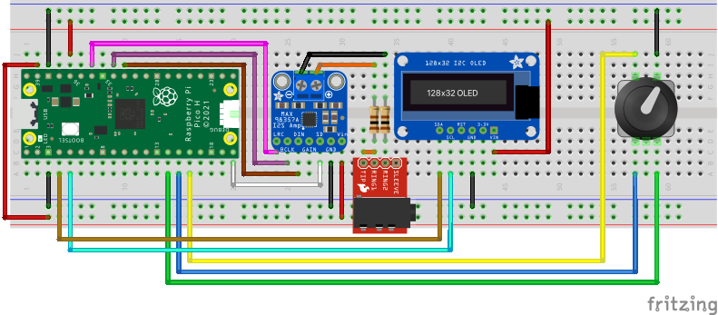
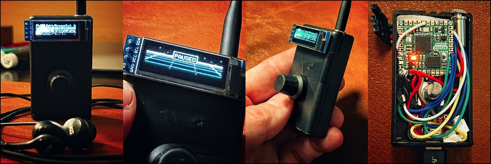

___

_The SIDPod is a PSID player for RP2040 microcontroller based boards, such as the
[Raspberry Pi Pico](https://www.raspberrypi.com/products/raspberry-pi-pico/) or the
[Solder Party RP2040 Stamp](https://www.solder.party/docs/rp2040-stamp/). Playback is based on the SID emulator found in
[Rockbox](https://www.rockbox.org/), which in turn is based on TinySID._

<!-- TOC -->
  * [Building](#building)
    * [Software](#software)
      * [Building from source](#building-from-source)
      * [Prebuilt binaries](#prebuilt-binaries)
    * [Hardware](#hardware)
      * [Construction](#construction)
      * [Power](#power)
      * [Bill of materials](#bill-of-materials)
  * [Using](#using)
    * [Finding music](#finding-music)
    * [Adding music](#adding-music)
    * [Playback](#playback)
    * [Volume and level control](#volume-and-level-control)
    * [Pocket mode](#pocket-mode)
    * [Deep sleep](#deep-sleep)
<!-- TOC -->

## Building

### Software

#### Building from source

SIDPod requires both the [Raspberry Pi Pico SDK](https://github.com/raspberrypi/pico-sdk/) and the
[pico-extras](https://github.com/raspberrypi/pico-extras). Make sure to grab these and either put them next to the
SIDPod directory or, if you have them somewhere else, point the `PICO_SDK_PATH` and `PICO_EXTRAS_PATH` environment
variables to their respective location. You'll also need CMake on your path. If/when these prerequisites have been
satisfied, you're almost ready to run the `cmake` command to create the build directory and configure the build. One
last thing to do is to make sure the board type matches the one you have. By default, SIDPod builds for the Solder Party
RP2040 Stamp, which, for example, has a larger NAND flash than the more common Raspberry Pi Pico. Using a RP2040 Stamp
UF2 on a Pi Pico would most likely cause issues on the first run, as the flash will get formatted, **using board
specific settings**, if no readable FAT filesystem is found on it. Changing board type can either be done by modifying
the `PICO_BOARD` variable in [CMakeLists.txt](CMakeLists.txt) or by setting the `PICO_BOARD` environment variable before
running the `cmake` commands. The correct value for the Raspberry Pi Pico is 'pico'. Once this is done, the build is
configured by running:

`cmake -B cmake-build-debug`

Alternatively, if you have [Ninja](https://ninja-build.org/) installed, you can save a few seconds of your valuable time
by instead running:

`cmake -G Ninja -B cmake-build-debug`

Then, to build the _SIDPod.uf2_ binary, issue:

`cmake --build cmake-build-debug --target all -j 12`

Once the build finishes, just follow the official instructions for loading a UF2 binary onto the board. For Raspberry Pi
Pico you hold down the _BOOTSEL_ button when you plug it in and then copy _SIDPod.uf2_ to it, once it appears as a
drive named _RPI-RP2_. For some other types of boards, such as the Solder Party RP2040 Stamp, this mode is activated by
double-clicking the reset button.

Also note that if you're running macOS, copying using Finder might fail with this
error: _The operation can’t be completed because an unexpected error occurred (error code 100093)._
If this is the case, fire up the 'ol terminal and do:

`cp cmake-build-debug/SIDPod.uf2 /Volumes/RPI-RP2`

#### Prebuilt binaries

To get a jump start you can also grab the [prebuilt binaries](https://github.com/henrikenblom/SIDPod/releases/latest).
There are two versions, one for the Solder Party RP2040 Stamp and one for the Raspberry Pi Pico.

### Hardware

#### Construction

Since the main goal is to make a portable player, the actual build and design is up to you, the maker. My current
prototype is built inside a 3-AA battery box I had lying around, using a Solder Party RP2040 Stamp and a 3.7V 150mAh
LiPo battery. However, the breadboard design I'm using for development, based on a Raspberry Pi Pico H, looks like this:

  
_The breadboard schematics._

In reality, the development breadboard looks a bit different. I use a dual lane breadboard and connect to the SIDPod
Pico board via a [Picoprobe](https://github.com/raspberrypi/picoprobe), for debugging and a less painful development
process.

  
_The development breadboard setup._

  
_The working prototype. Please excuse the soldering. I'm a lover, not a solderer. 😜_

#### Power

The main advantage of the Solder Party RP2040 Stamp, besides its size, is the onboard LiPo charger. This removes some
complexity and saves space when moving beyond the breadboard design. Many RP2040 projects can easily run off the power
provided from the host computer over the built-in USB port. The SIDPod however, will enter a special USB device state
and start to mimic a USB mass storage device once connected to a computer. [More on that here](#adding-music). This
poses a problem, if you actually want to use it for what it's designed for - to play PSIDs. That problem can easily be
solved by powering it from any power source connected to the _VSYS_ pin. That power source can be anything from a 3.7V
LiPo battery to a separate USB breakout bord, with the breakout boards _VBUS_ connected to _VSYS_ on the Pico Board and
the breakout board GND connector connected to any GND on the Pico Board. In my development breadboard setup I power the
SIDPod Pico Board from the Picoprobe Pico Board. In the next section I've listed the components needed for a few
different options:

#### Bill of materials

_Option 1 - Using a Solder Party RP2040 Stamp (the prototype setup):_

- 1 x [Solder Party RP2040 Stamp](https://www.electrokit.com/en/product/rp2040-stamp/)
- 1 x [Adafruit I2S 3W Class D Amp - MAX98357A](https://www.electrokit.com/en/product/forstarkare-klass-d-3w-mono-i2s/)
- 1 x [LCD OLED 0.91″ 128x32px I2C](https://www.electrokit.com/en/product/lcd-oled-0-91-128x32px-i2c/)
- 1 x 3.5mm stereo jack
- 1 x [Rotary encoder w switch](https://www.electrokit.com/en/product/rotary-encoder-module/)
- 2 x [100Ω resistor](https://www.electrokit.com/en/product/resistor-1w-5-100ohm-100r/)
- 1 x [Battery LiPo 3.7V 150mAh](https://www.electrokit.com/en/product/batteri-lipo-3-7v-150mah/)

_Option 2 - Using a Raspberry Pi Pico (the breadboard setup):_

- 1 x [Adafruit I2S 3W Class D Amp - MAX98357A](https://www.electrokit.com/en/product/forstarkare-klass-d-3w-mono-i2s/)
- 1 x [LCD OLED 0.91″ 128x32px I2C](https://www.electrokit.com/en/product/lcd-oled-0-91-128x32px-i2c/)
- 1 x [3.5mm stereo jack](https://www.electrokit.com/en/product/3-5mm-jack-breakout-2/)
- 1 x [Rotary encoder w switch](https://www.electrokit.com/en/product/rotary-encoder-module/)
- 2 x [100Ω resistor](https://www.electrokit.com/en/product/resistor-1w-5-100ohm-100r/)

_Option 2a - Add a Raspberry Pi Pico with Picoprobe, for debugging, binary upload and power through VSYS:_

- 2 x [Raspberry Pi Pico H](https://www.electrokit.com/en/product/raspberry-pi-pico-h/)

_Option 2b - Power the Raspberry Pi Pico through a USB breakout board:_

- 1 x [Raspberry Pi Pico H](https://www.electrokit.com/en/product/raspberry-pi-pico-h/)
- 1 x [Breakout board USB-C](https://www.electrokit.com/en/product/anslutningskort-usb-c/)

## Using

To keep the construction as simple as possible I tried to minimize the number of physical controls, and a rotary encoder
with a built-in push button provides enough versatility to cater to every possible use case of this rather minimal
design. Therefore, controls are both contextual and pattern driven.

### Finding music

The [SID or Sound Interface Device](https://en.wikipedia.org/wiki/MOS_Technology_6581), which this player does a
rudimentary emulation of, was a component in the world's most popular home computer, the
[Commodore 64](https://en.wikipedia.org/wiki/Commodore_64). Due to its legendary status and, to this day, very active
community, there's no shortage of SID files to fill your SIDPod with. The most complete collection is the
[High Voltage SID Collection](https://www.hvsc.c64.org/). It has everything, from cult classics by the legendary Jeroen
Tel to contemporary pieces by Kamil Wolnikowski, aka Jammer. Download the full archive and use one of the SID players
referenced on that page to find the music you like. The collection contains both PSIDs and RSIDs. However, RSID playback
requires either a real C64 or a more sophisticated emulator than TinySID. More on the effects of this in the next
section.

### Adding music

The SIDPod doubles as a USB mass storage device, which means that if you plug it in to your computer it will show up as
a regular, FAT-formatted drive. This means that adding and removing PSIDs is as easy as copying or deleting files. There
are a few caveats though:

- Only PSIDs are supported, RSIDs are filtered out. Unfortunately they share the same file extension, which means it's
  impossible to know beforehand if a SID file is playable or not. So, if you add a tune to the SIDPod, and it doesn't
  show up, this is most likely the cause.
- PSIDs must be put in the root directory.
- Use it with moderation. [FatFs](http://elm-chan.org/fsw/ff/00index_e.html) doesn't have any
  [wear levelling algorithm](https://en.wikipedia.org/wiki/Wear_leveling), and NAND flash storage wears out faster than
  regular flash drives. Note though that this only goes for write operations. Reading is totally harmless.
- It's slower than you're probably used to. This is due to several factors. One being that flash memory blocks needs to
  be erased before new data can be written to them.

While the SIDPod is connected, the screen shows flickering bars. Don't be alarmed. This is a feature, not a bug. In
fact, it's a reference to the C64 - those who know, know.

### Playback

Once you've added some funky tunes and **safely disconnected** the SIDPod it presents the titles. In the order they were
added. The controls in this mode are:

- Scroll through the list by turning the encoder.
- Single-clicking plays the selected song and enters a very retro-fancy visualization mode.
- Double-clicking plays or pauses the selected song but keeps the playlist mode.
- Double-clicking in visualization mode pauses playback and displays a pause notification on screen.

The currently selected song is decorated with a traditional play symbol and the currently playing song is decorated with
an animated spectrum analyser symbol. When a song is paused, the animation is paused as well.

If a song gets crossed out when you're trying to play it, it means that it's either corrupt or uses a combination of
opcodes that have caused the song loading routine to enter an infinite loop and seemingly hang. This is very rare.

### Volume and level control

These controls are only available from the visualization mode and are activated by rotating the encoder. The controls in
this mode are:

- Lower/raise the volume by turning the encoder.
- Single-clicking toggles line level on/off. Use this if you notice distortion when the SIDPod is connected to an
  amplifier.

After two seconds of inactivity the SIDPod returns to the visualization mode.

### Pocket mode

In this mode the screen is turned off, as well as the regular controls. Playback is still active though, which makes it
perfect for when you're out and about. To enter this mode, simply hold the button pressed until the screen goes black.
This takes exactly one second. Be careful not to hold it for too long, as this will put the SIDPod to sleep. More on
that in the next section. To get out of pocket mode, simply double-click, and it will return to whatever mode you were
in before entering pocket mode.

### Deep sleep

This mode is as close as you can get to turning the SIDPod off. As with pocket mode, all regular controls are disabled.
Additionally, playback is stopped, as well as USB device clocks. In fact, in this mode, even both processor cores are
stopped, meaning that the power consumption is next to nothing. To enter deep sleep, press the button for more than two
and a half second. To get out, just double-click.